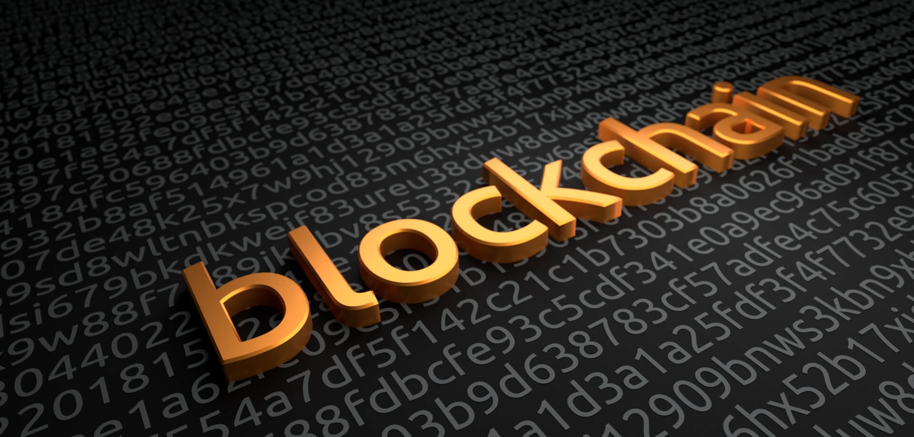

# What are Blockchain and Web3?

Blockchain is a decentralized distributed ledger technology that allows for secure and transparent transactions without the need for intermediaries. It is the foundation for Web3, a set of protocols focused on changing the backend wiring of the internet. Web3 uses blockchain in new ways to new ends, such as storing tokens, self-executing contracts, and decentralized apps. Web3 is a catch-all term for the vision of a new, better internet that gives power back to the users in the form of ownership.

## Key Features

- Decentralization: Blockchain and Web3 are decentralized systems allowing users to interact without intermediaries.
- Transparency: Blockchain provides transparency by allowing all participants to view transactions on the network.
- Immutability: Once data is recorded on a blockchain, it cannot be altered or deleted.
- Security: Blockchain uses cryptographic algorithms to secure transactions and prevent fraud.
- Smart Contracts: Smart contracts are self-executing contracts that automatically enforce the terms of an agreement between parties.
- Tokenization: Tokens are digital assets that can represent anything from currency to real estate. They can be traded on blockchain networks.

# Exploring Web3

Web3, also known as Web 3.0 or the decentralized web, is an evolving concept that aims to redefine the way we interact with the internet. It builds upon the principles of blockchain and decentralization to create a more user-centric and open digital environment.

Web3 envisions a future where individuals have greater control over their data and digital identities. It promotes the idea of self-sovereign identity, where users have ownership of their personal information and can selectively share it with trusted entities. This shift from centralized data silos to user-owned data empowers individuals and enhances privacy and security.

At the core of Web3 is the concept of decentralized applications (dApps). These are software applications that run on a blockchain network, leveraging its decentralized infrastructure and smart contracts capabilities. Unlike traditional applications, dApps operate on a distributed network, eliminating the need for intermediaries and providing enhanced security, transparency, and censorship resistance.

# Challenges and Future Outlook
Despite the promising potential of blockchain and Web3, there are several challenges that need to be addressed for widespread adoption. One major challenge is scalability. Blockchains like Bitcoin and Ethereum face limitations in terms of transaction speed and throughput, which hinders their usability in high-demand scenarios.

Energy consumption is another concern associated with blockchain, particularly with proof-of-work consensus mechanisms. As blockchain networks grow, the computational power required to mine new blocks increases, resulting in substantial energy consumption. Efforts are being made to explore more energy-efficient consensus algorithms and sustainable blockchain solutions.

Regulatory frameworks also need to be developed to accommodate the unique characteristics of blockchain and Web3. Governments and regulatory bodies are working on establishing legal frameworks that protect users, prevent illicit activities, and promote innovation without stifling the potential of these technologies.

User experience and interface design are critical for the mass adoption of blockchain and Web3 applications. Currently, many decentralized applications lack the user-friendly interfaces and seamless experiences that mainstream users expect. Improving the user experience will be crucial to drive broader adoption and make these technologies more accessible to the general public.

Looking ahead, the future of blockchain and Web3 is promising. Significant investments are being made in research and development,
