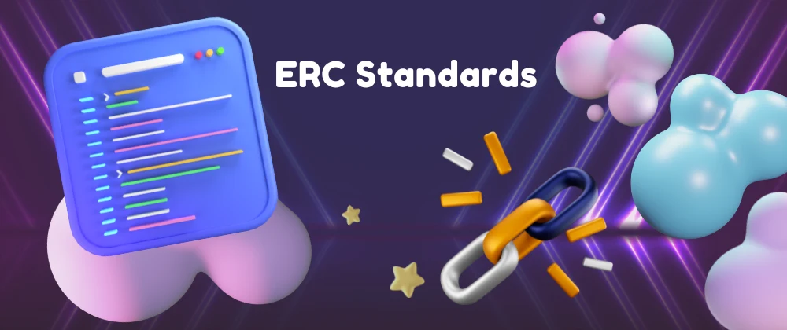

# Ξ What are Ethereum request for comments (ERC) Standards

An ‘Ethereum Request for Comments’ (ERC) is a document that programmers use to write smart contracts on Ethereum Blockchain. They describe rules in these documents that Ethereum-based tokens must comply with.

The Ethereum community uses a process called the ‘Ethereum Improvement Proposal’ to review these documents. They comment on it and as a result of that, the developer that created the document may revise it.

The Ethereum community accepts some of these documents after working through the EIP process, finalizes it, and then developers implement it. This is how the document becomes an ERC. In other words, ERCs originate as EIPs and could address different areas, for e.g., tokens, registration name, etc.

While there are several Ethereum standards. These ERC Ethereum standards are the most well-known and popular –

- ERC - 20
- ERC - 721
- ERC - 1155
- ERC - 777

---

## ERC 20 standard – The Most Popular Token Standard

The ERC-20 introduces a standard for Fungible Tokens, in other words, they have a property that makes each Token be exactly the same (in type and value) as another Token. For example, an ERC-20 Token acts just like the ETH, meaning that 1 Token is and will always be equal to all the other Tokens.

The ERC-20 token standard allows developers to create their own tokens on the Ethereum network. It has provided an easier route for companies to develop blockchain products instead of building their own cryptocurrency.

Some tokens, like Uniswap's `UNI` token, are set to remain ERC-20 tokens; other cryptocurrencies, such as `Binance Coin`, have since jumped over to their own blockchains.

These tokens are:

- 💻 Fungible - The code of each individual token is the same as any other, though transaction histories can be used to identify and separate out the tokens involved.
- 🛫 Transferable - They can be sent from one address to another.
- ⛏️ Fixed supply - A fixed number of tokens must be created so that developers cannot issue more tokens and raise the supply.

Since the ERC-20 token standard was finalized, over 500,000 tokens compatible with ERC-20 have been issued. Some of the leading ERC-20 tokens include:

- 🦄 Uniswap (`UNI`) - A decentralized exchange (DEX) that enables users to swap tokens peer-to-peer, without relying on a centralized intermediary.
- 👾 Decentraland (`MANA`) - The token underpinning metaverse platform Decentraland, MANA is burned in order to acquire non-fungible LAND tokens representing plots of virtual land.
- 🦍 ApeCoin (`APE`) - The utility and governance token for the Bored Ape Yacht Club ecosystem, based on the popular PFP (profile picture) NFT collection.

### Disadvantages of ERC-20 tokens?

- ⚠️ Low throughput - The Ethereum network has been clogged up when dapps have experienced high demand, such as CryptoKitties (which has since moved to its own Flow blockchain). When this happens, the network slows down and transactions become more expensive.
- 🐢 Slow transactions - The block time is around 14 seconds, so transactions can take up to a minute to process. This may be adequate for some uses or too slow for others.
- ⏲️ ETH - When transactions are made involving ERC-20 tokens, a second cryptocurrency is needed to pay for the transaction fees. This can add both time and cost, as it can result in dust on different platforms.

---

## ERC 721 – The Standard for Non Fungible Tokens

ERC-721 is a token standard on Ethereum for non-fungible tokens (`NFTs`). Fungible means interchangeable and replaceable; Bitcoin is fungible because any `Bitcoin` can replace any other Bitcoin. Each NFT, on the other hand, is completely unique. One NFT cannot replace another.

The main characteristic of ERC-721 tokens is that each one is unique. When an ERC-721 token is created, there is one and only one of those tokens in existence. These tokens, as NFTs, have spread the idea and application of unique assets on Ethereum.

### `What can you do with ERC-721 NFTs?`

Today, the most common use case for ERC-721 NFTs is for digital art. Users buy these NFTs for a number of reasons, including supporting artists, investing long-term in hopes that the price will go up, quickly flipping/trading NFTs for a profit, or simply because they like the artwork.

However, use cases for NFTs extend beyond digital art.

> NFTs are commonly used in blockchain-based games, such as [Gods Unchained](https://godsunchained.com/), to represent unique assets within the game. The online collectible card game uses NFTs to represent digital cards, which can then be traded with other players or used in battles. Some blockchain-based games even let you move your items over to different games. This is the beginning of the Metaverse, a persistent virtual environment in which NFTs represent digital objects that can be moved between different platforms.

> Music NFTs are also becoming increasingly popular. Platforms such as [Audius](https://audius.co/) make it easy for artists to mint their work as ERC-721 tokens.

---

## ERC-1155 - Ethereum’s Flexible Token Standard

Prior to ERC-1155, the two predominant token standards were ERC-20 for fungible tokens and ERC-721 for non-fungible tokens. They could not (and cannot) be wrapped into the same smart contract. This limitation meant that if someone wanted to transfer, say, USDC (ERC-20) and a CryptoKitties NFT (ERC-721), they would need to execute multiple transactions, which was inefficient and expensive.

ERC-1155 solves for this by combining the two token standards. ERC-1155 is a token standard that enables the efficient transfer of fungible and non-fungible tokens in a single transaction.

### How does ERC-1155 work?

The initial motivation behind ERC-1155 was to address challenges faced by blockchain game developers and players.

Massively multiplayer online games (MMOs) contain tens of thousands of items—armor, weapons, shields, skins, coins, badges, castles, etc—that players can collect and trade with one another. Some items like coins are fungible while others like a sword are non-fungible. On the blockchain, each one of these items is a token.

**Prior to ERC-1155, each item required its own smart contract. In a game with 100,000 items that means 100,000 smart contracts!**

With an ERC-1155 token, multiple items can be stored in a single smart contract and any number of items can be sent in a single transaction to one or more recipients. This means if you wanted to send a sword to one friend, a shield to another, and 100 gold coins to both, you could do so in only one transaction.

### What's so special about ERC-1155?

As well as allowing for the transfer of multiple token types at once, and the attendant gains in efficiency and lower transaction costs, ERC-1155 has a number of other special characteristics:

- It supports an infinite number of tokens, in contrast with ERC-20 and ERC-721, which require a new smart contract for each type of token.
- It supports not only fungible and non-fungible tokens, but also semi-fungible tokens. Semi-fungible tokens are like general admission concert tickets. They are interchangeable and can be sold for money before the show (fungible). But after the show they lose their pre-show value and become collectibles (non-fungible).
- It has a safe transfer function that allows tokens to be reclaimed if they are sent to the wrong address, unlike ERC-20 and ERC-1155
- It removes the need to "approve" individual token contracts separately, which means signing fewer transactions

### Who's using ERC-1155?

- 🎮 `Enjin` - Enjin offers a number of blockchain products, many of which implement ERC-1155.
- 🕹️ `Horizon` - Horizon is a blockchain games company whose [Skyweaver](https://horizon.io/#skyweaver) game uses ERC-1155.
- 🖼️ `OpenSea` - The NFT marketplace's ERC-1155 implementation allows multiple creators per smart contract but only one creator is able to mint more copies.
- 🎈 `OpenZeppelin` - OpenZeppelin's blockchain security products leverage the ERC-1155 standard.

---

## ERC 777 – Reduces Friction in Crypto Transactions

ERC-777 is a token standard for fungible tokens introduced on the Ethereum network that is fully compatible with existing decentralized exchanges.

It facilitates complicated token trade interactions and assists the removal of ambiguity around decimals, minting, and burning. It utilizes a distinctively effective feature called a hook.

A hook is simply a function in a contract that is called when tokens are sent to it, meaning accounts and contracts can react to receiving tokens.

When tokens are delivered to a computer-based analytical contract, it activates a hook mechanism that streamlines how accounts and contracts communicate when receiving tokens. Furthermore, ERC-777 tokens are significantly less likely to get stuck in a contract, which is traditionally seen as a problem with ERC-20 tokens.

Hooks are programmed into the standard. If you transfer ETH to a smart contract, it will be alerted about the incoming ETH through the hooks, a feature that ERC20 tokens don’t have. The following are the benefits of this standard:

- The ERC777 standard is backwards compatible with ERC20, meaning you can interact with these tokens as if they were ERC20, using the standard functions
- ERC-777 enables anyone to add extra functionality to tokens, such as a mixer contract, for greater transaction confidentiality, or an emergency recovery feature to help you if you lose your private keys.

---
