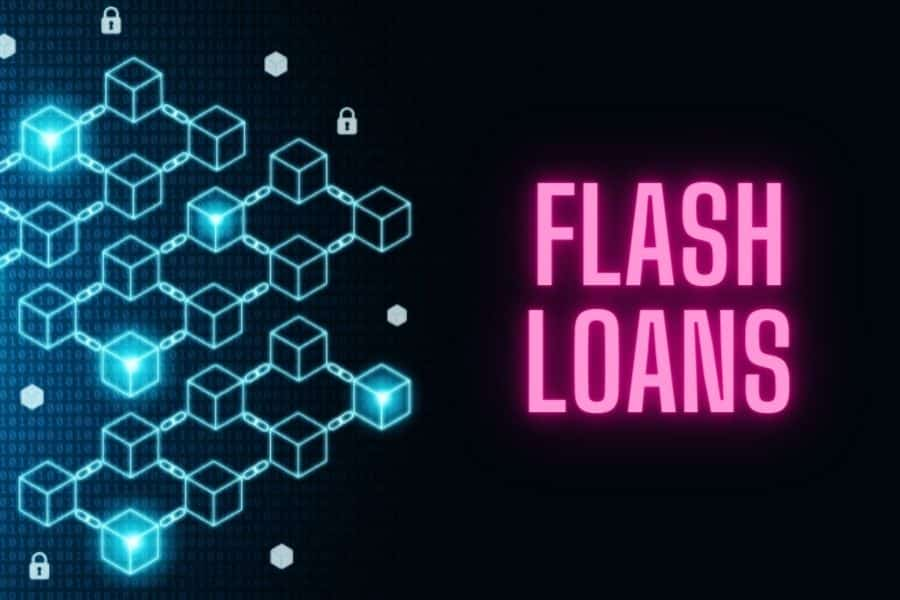

<h1 align="center"> All about Flash Loans </h1>

Flash loans are a relatively new phenomenon in the world of finance, made possible by the emergence of decentralized finance (DeFi) platforms on the blockchain. In this blog, we will explore what flash loans are, how they work, and some of the risks and opportunities associated with this innovative financial tool.

### -> What are Flash Loans?

A flash loan is a type of uncollateralized loan that allows borrowers to borrow funds without providing any collateral. Unlike traditional loans that require collateral, such as a house or car, flash loans are only available to users of decentralized finance (DeFi) platforms, and the loan is automatically repaid within the same transaction that initiated the loan.

The concept of flash loans was first introduced by the Aave protocol in 2019. Since then, flash loans have become increasingly popular within the DeFi ecosystem, as they allow users to access large amounts of capital without having to put up collateral.

### -> How Do Flash Loans Work?

Flash loans work by taking advantage of the unique properties of blockchain technology. In a traditional loan, the borrower would be required to put up collateral to secure the loan. However, in a flash loan, the loan is only available for the duration of a single blockchain transaction. This means that the loan can be initiated and repaid within a matter of seconds.

To understand how this works, let's take a closer look at the steps involved in a flash loan:

The borrower initiates a flash loan by requesting a specific amount of funds from a DeFi lending platform.

The platform checks to make sure that the borrower has enough collateral to cover the loan.

Once the loan is approved, the funds are sent to the borrower's wallet, and the borrower can use the funds for any purpose.

Within the same transaction, the borrower must repay the loan, including any interest or fees that were agreed upon when the loan was initiated.

If the loan is not repaid within the transaction, the loan is automatically canceled, and the funds are returned to the lending platform.

### -> Advantages of Flash Loans

1. Flash loans offer several advantages over traditional loans, including:

2. No collateral required: Unlike traditional loans, flash loans do not require collateral, which means that borrowers can access funds without putting their assets at risk.

3. Instant access to funds: Flash loans are processed within seconds, which means that borrowers can access funds almost instantly.

4. Flexible repayment terms: Flash loans have flexible repayment terms, which means that borrowers can repay the loan on their own terms.

### -> Risks of Flash Loans

1. While flash loans offer many benefits, there are also several risks associated with this type of lending, including:

2. High fees: Flash loans often come with high fees, which can make them expensive to use.

3. Market volatility: Since flash loans are often used for arbitrage opportunities, borrowers are exposed to market volatility, which can lead to significant losses.

4. Technical risks: Flash loans are dependent on the technical infrastructure of the blockchain, which means that they are vulnerable to hacking and other technical risks.

### Conclusion

Flash loans are a powerful financial tool that allows borrowers to access funds without having to provide collateral. While there are risks associated with this type of lending, the benefits of flash loans make them an attractive option for many users of decentralized finance platforms. As the DeFi ecosystem continues to evolve, we can expect to see more innovative financial tools like flash loans emerge in the coming years.

