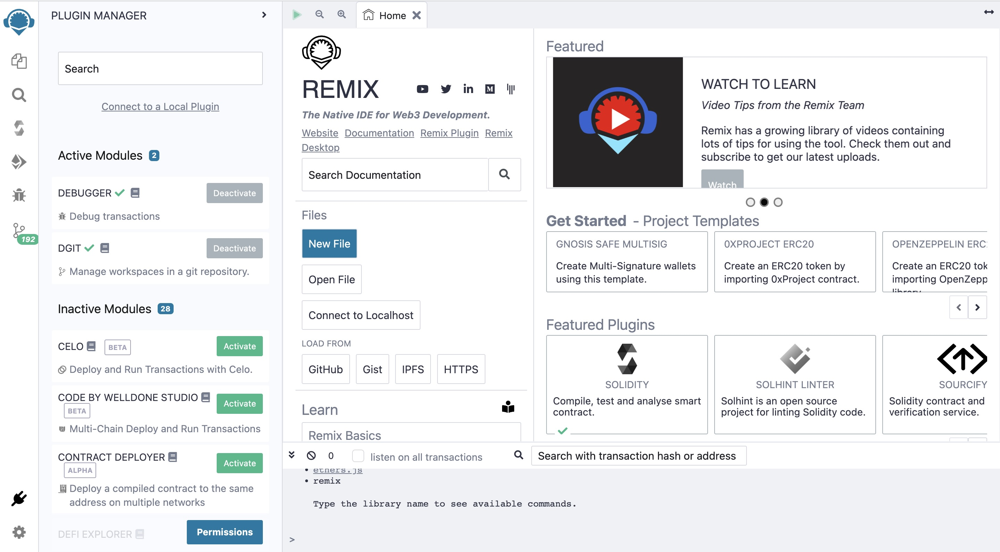
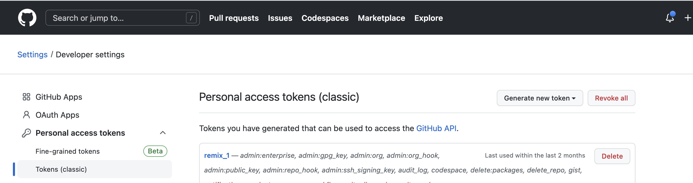
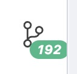
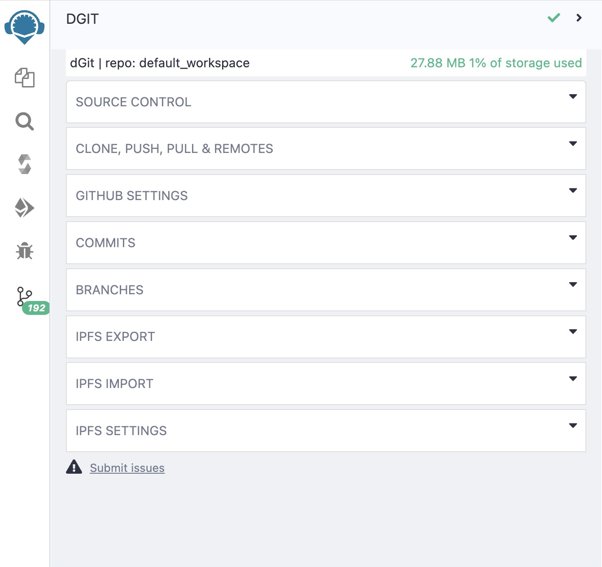
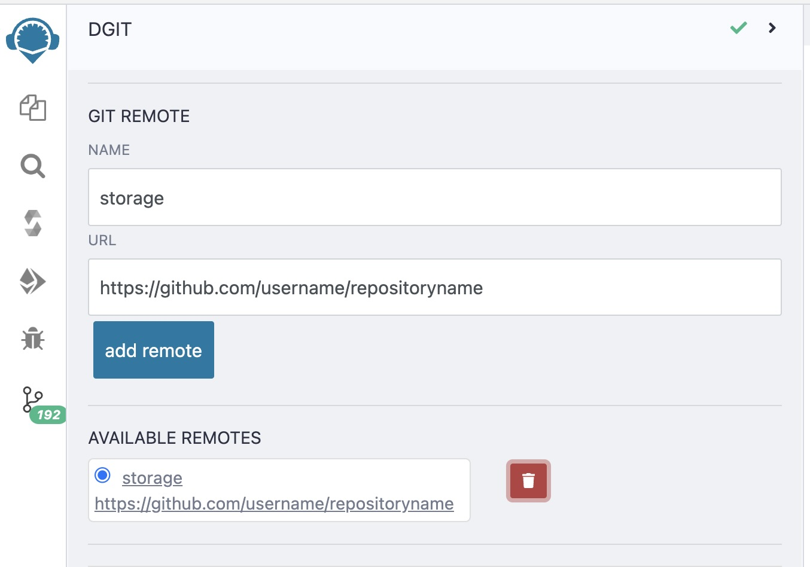
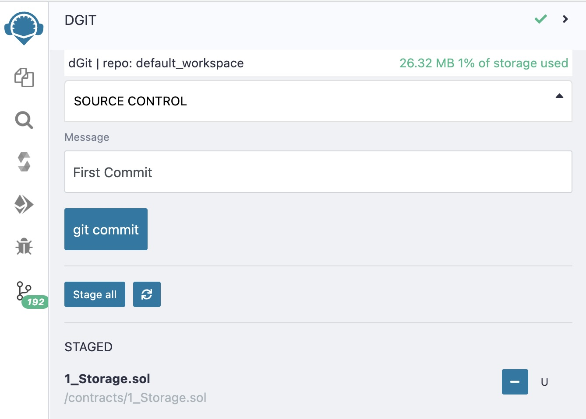
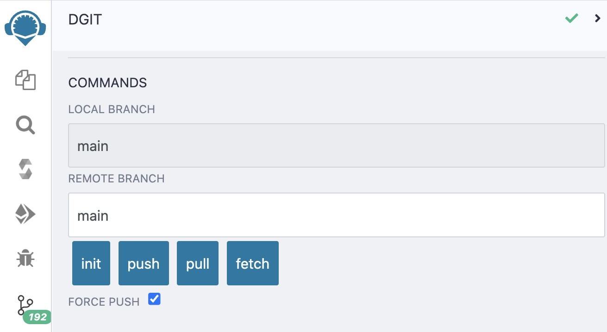

# Pushing smart contracts on GitHub from Remix IDE

This is step-by-step guide for how to push smart contracts directly on GitHub from Remix IDE in simple steps.

1. Go to Remix IDE. (https://remix.ethereum.org/). You will see window opened like this
    

2. Click on the plugin manager icon in the bottom-right corner.

   

3. Search for DGIT module in search bar as shown in first image.
4. Click on Activate button. 
5. Once its activated go to the GitHub and log in to your account.Go to the settings then to Developers setting option.
  
  you'll see window like above. Select Personal access token and then Token(classic).
6. Click on Generate new token, fill all the required fields and give all required permissions. Once the token is generated , copy it and go to home page of GitHub.
7. Create new repository and head back to Remix IDE.
8. In Remix, click on DGIT GitHub changes option. You'll see window opened like this.
   
    
   
   

9. Click on CLONE, PUSH, PULL & REMOTE option and go to GIT REMOTE field. 
10. Give appropriate name and paste URL of the GitHub repository you cerated few minutes ago and click on Add Remote button.
     
11. Now go to SOURCE CONTROL option and write commit message in Message field and choose the smart contract which you want to upload on GitHub.
12. Once you select the smart contract and write message, click on Git Commit button.
    
13. Now go to CLONE, PUSH, PULL & REMOTE option again and then COMMANDS option.Check the box for Force Push to avoid errors and then press Push button.And you're done!!!
    
14. Go to GitHub repository and check whether smart contract is pushed in it or not. 
    