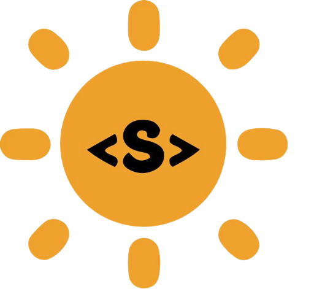

[](https://gitpod.io/#https://github.com/Vikash-8090-Yadav/Web3.0-World)

# <p align = "center"> Web3.O.World </p>


  <div align="center">
 <p>

[](https://github.com/ellerbrock/open-source-badges/)


  


 </p>
 </div>
 
 ## 📌 Open Source Program

 ### This project is a part of following Open Source Programs

 ---

<div align="center">


  
   &nbsp;&nbsp;&nbsp;&nbsp;&nbsp;
  
</div>


 ---
 

##  About Web3.O.World
The one place for the Web3  developer to showcase their ideas and code. Here web3 basically means the Web2 which uses the concept of the blockchain i.e (Web2+smart contract) == Web3. 
This repo will have web3 project which consist of the smart contract(backend) and frontend part. For the backend part there is smart contract and we can use any tech stack for the frontend in blockchain.

 I welcome all the Web3,Web2 developer to contribute in this repo .
  
## How to Contribute?

- Take a look at the existing [Issues](https://github.com/Vikash-8090-Yadav/Web3.0-World/issues) 
- Fork the Repo create a branch for any issue that you are working on and commit your work.
- Create a ** [Pull Request](https://github.com/Vikash-8090-Yadav/Web3.0-World/pulls), which will be promptly reviewed and given suggestions for improvements by the community.
- Add screenshots or screen captures to your Pull Request to help us understand the effects of the changes that are included in your commits.

## How to make a Pull Request?

**1.** Start by forking the [**Web3.O.World**](https://github.com/Vikash-8090-Yadav/Web3.0-World) repository. Click on the <a href="https://github.com/Vikash-8090-Yadav/Web3.0-World/fork"></a> symbol at the top right corner.

**2.** Clone your forked repository:

```bash
git clone https://github.com/<your-github-username>/Web3.0-World
```

**3.** Navigate to the new project directory:

```bash
cd Web3.O.World
```

**4.** Set upstream command:

```bash
git remote add upstream https://github.com/Vikash-8090-Yadav/Web3.0-World
```

**5.** Create a new branch:

```bash
git checkout -b YourBranchName
```
<i>or</i>
```bash
git branch YourBranchName
git switch YourBranchName
``` 

**6.** Sync your fork or local repository with the origin repository:

- In your forked repository click on "Fetch upstream"
- Click "Fetch and merge".

### Alternatively, Git CLI way to Sync forked repository with origin repository:

```bash
git fetch upstream
```

```bash
git merge upstream/main
```

### [Github Docs](https://docs.github.com/en/github/collaborating-with-pull-requests/addressing-merge-conflicts/resolving-a-merge-conflict-on-github) for Syncing

**7.** Make your changes to the source code.

**8.** Stage your changes and commit:

⚠️ **Make sure** not to commit `package.json` or `package-lock.json` file

⚠️ **Make sure** not to run the commands ```git add .``` or ```git add *```. Instead, stage your changes for each file/folder

```bash
git add file/folder
```

```bash
git commit -m "<your_commit_message>"
```

**9.** Push your local commits to the remote repository:

```bash
git push origin YourBranchName
```

**10.** Create a [Pull Request](https://help.github.com/en/github/collaborating-with-issues-and-pull-requests/creating-a-pull-request)!

**11.** **Congratulations!** You've made your first contribution! 🙌🏼

# How to Setup Locally 

**1.** Follow the [PR STEPS](https://github.com/Vikash-8090-Yadav/Web3.0-World/edit/main/README.md#how-to-make-a-pull-request) , after   cloning repo in your local system 


##  **2.**  Install Dependencies !!

```
npm install node 
```


 (i) if that project using Web3 , Truffle then follow this steps , -> [Truffle , web3 , Ganache ](https://web3js.readthedocs.io/en/v1.2.11/getting-started.html)
 
 (ii) If using Hardhat , Ether -> https://hardhat.org/hardhat-runner/docs/getting-started#overview
 


**3.** Hardhat Tutorial -> https://www.youtube.com/watch?v=FIiekfY6q7Y&t=1085s

**4.** Web3 Tutorial -> https://www.youtube.com/watch?v=pZjQxs1piEk&list=PLgPmWS2dQHW9F8fRXzrFBtcrwE-uS8Qa5


**4.** Congratulations 🙌🏼 , You have setup the Blockchain project  in your PC ,It's time to check the code and Raise a PR 

</br>
<p align = "center">
Show some ❤️&nbsp; by giving  to this repo
</p>

### Project Contributors
<a href="https://github.com/Vikash-8090-Yadav/Web3.0-World/graphs/contributors">

</a>
